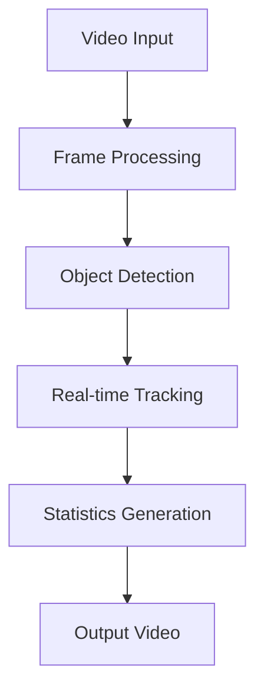
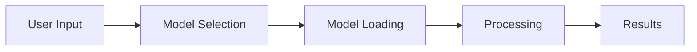

# COS40007-ARTIFICIAL-INTELLIGENCE-FOR-ENGINEERING
# 🚗 Object Detection Model Comparison using YOLO Variants

[](https://www.python.org/)
[](https://github.com/ultralytics/yolov5)
[](https://colab.research.google.com/)
[](LICENSE)

## 📋 Table of Contents
- [Project Description](#project-description)
- [Project Structure](#-project-structure)
- [Models Implemented](#-models-implemented)
- [Dataset](#-dataset)
- [Scripts](#-scripts)
- [Model Evaluation and Results](#-model-evaluation-and-results)
- [Getting Started](#-getting-started-with-google-colab)
- [Acknowledgements](#-acknowledgements)
- [Advanced Features](#-advanced-features)

## 🎯 Project Description

This project focuses on implementing, comparing, and evaluating various versions of the YOLO (You Only Look Once) object detection model, specifically **YOLOv5, YOLOv8, YOLOv9, YOLOv11, and YOLOv12**. The goal is to assess their performance on car detection tasks using a dedicated dataset of car images and videos.

### 🔍 Key Features
- ⚡ Multiple YOLO model implementations
- 📊 Comprehensive model comparison
- 🎯 Car detection optimization
- 📈 Performance evaluation metrics
- 🚀 Easy-to-use Google Colab integration

## 📁 Project Structure

```bash
COS40007-ARTIFICIAL-INTELLIGENCE-FOR-ENGINEERING/
├── 📂 yolov5/              # YOLOv5 implementation
├── 📂 yolov8/              # YOLOv8 implementation
├── 📂 yolov9/              # YOLOv9 implementation
├── 📂 yolov11/             # YOLOv11 implementation
├── 📂 yolov12/             # YOLOv12 implementation
├── 🏆 best_model/          # Best performing model
├── 📊 Model_Evaluation_Result/  # Evaluation metrics and results
├── 📸 Car_videos_images/   # Dataset examples
└── 📝 ipynb_scripts/       # Google Colab notebooks
```

## 🤖 Models Implemented

| Model | Version | Features |
|-------|---------|----------|
| YOLOv5 | v5.0 | Fast inference, good accuracy |
| YOLOv8 | v8.0 | Improved accuracy, better speed |
| YOLOv9 | v9.0 | Enhanced feature extraction |
| YOLOv11 | v11.0 | Advanced architecture |
| YOLOv12 | v12.0 | Latest improvements |

## 🖼️ Dataset

The dataset is structured into three partitions:

### 📚 Training Dataset
- Source: Online datasets + Roboflow augmentation
- Purpose: Model training

### 🧪 Testing Dataset
- Source: Real-world captures (roads + Swinburne Sarawak Campus)
- Purpose: Model evaluation

### ✅ Validation Dataset
- Source: Samples from training and testing
- Purpose: Hyperparameter tuning

### 📂 Dataset Structure
```
yolovXX/
├── train/
│ ├── images/
│ └── labels/
├── test/
│ ├── images/
│ └── labels/
├── valid/
│ ├── images/
│ └── labels/
└── data.yaml
```


## 📜 Scripts

The `ipynb_scripts/` folder contains Google Colab notebooks for:

- 📥 Data preprocessing
- 🎯 Model training
- 📊 Evaluation
- 🔍 Inference

## ✨ Model Evaluation and Results

### 📊 Performance Metrics
- mAP (mean Average Precision)
- Precision
- Recall
- F1-Score

### 📈 Results Visualization
| Model Version | Epochs | mAP50 | Precision | Recall | Inference Speed | Notes |
|--------------|--------|-------|-----------|---------|-----------------|--------|
| YOLOv5 | 30 | 0.951 | 0.935 | 0.779 | 14.8ms/img | Lightweight and fast, but slightly lower recall than newer versions |
| YOLOv8 | 30 | 0.961 | 0.833 | 0.897 | 16ms/img | Balanced performance; improved mAP and recall; ideal for general use |
| YOLOv9 | 30 | 0.973 | 0.897 | 0.854 | 12.2ms/img | Highest mAP; best for accuracy-focused tasks; slightly slower |
| YOLOv11 | 30 | 0.964 | 0.907 | 0.922 | 5.6ms/img | Fastest inference; suitable for real-time scenarios with good recall |
| YOLOv12 | 30 | 0.964 | 0.931 | 0.886 | 9.5ms/img | High precision and recall balance; moderate speed and performance |

<div align="center">Test in new testing dataset</div>


## 🚀 Getting Started with Google Colab

### 1. Clone Repository
```python
!git clone https://github.com/K3NN3TH-KUAN/COS40007-ARTIFICIAL-INTELLIGENCE-FOR-ENGINEERING.git
```

### 2. Install Dependencies
```python
# YOLOv8, YOLOv9
!pip install ultralytics

# YOLOv5
!git clone https://github.com/ultralytics/yolov5
%cd yolov5
!pip install -r requirements.txt
%cd ..

# Additional libraries
!pip install opencv-python matplotlib pandas
```

### 3. Run Scripts
Navigate to `ipynb_scripts/` and run the desired notebook.

## 🎯 Advanced Features

<div align="center">
  
  <br>
  <em>Interactive Gradio Interface for Car Detection</em>
</div>

### 🖼️ Interactive Gradio Interface

#### 📸 Image Detection Features

| Feature | Description | Visual Indicator |
|---------|-------------|------------------|
| 🎯 Model Selection | Choose between YOLO versions | Dropdown menu |
| ⚖️ Confidence Threshold | Adjust detection sensitivity | Slider (0.1-1.0) |
| 🚨 Anomaly Detection | Real-time monitoring | Color-coded alerts |
| 📊 Detection Summary | Detailed statistics | Text output |

#### 🎥 Video Detection Features



| Feature | Description | Output |
|---------|-------------|---------|
| 📈 Frame Analysis | Per-frame detection | Real-time stats |
| 🎯 Object Tracking | Continuous monitoring | Tracking boxes |
| 📊 Video Summary | Overall statistics | Detailed report |

### 🎨 Visualization Features

#### Color Coding System
```python
CLASS_COLORS = {
    0: (255, 0, 0),    # Red
    1: (0, 255, 0),    # Green
    2: (0, 0, 255),    # Blue
    3: (255, 255, 0),  # Yellow
    4: (255, 0, 255),  # Magenta
}
```

<div align="center">
  <table>
    <tr>
      <td bgcolor="#FF0000" width="50">High Confidence</td>
      <td bgcolor="#808080" width="50">Low Confidence</td>
    </tr>
  </table>
</div>

### 🔧 Technical Features

#### Model Management System


| Component | Function | Status Indicator |
|-----------|----------|------------------|
| 🧠 Model Loading | Dynamic model management | Loading bar |
| ⚡ Processing | Real-time detection | Progress indicator |
| 📊 Results | Output generation | Success/Error icons |

### 🚀 Quick Start Guide

  

#### Step-by-Step Usage

1. **Model Selection** 🎯
   ```python
   # Available Models
   model_paths = {
       "YOLOv5": "best_yolov5lu.pt",
       "YOLOv8": "best_yolov8l.pt",
       "YOLOv9": "best_yolov9m.pt",
       "YOLOv11": "best_yolo11s.pt",
       "YOLOv12": "best_yolo12s.pt"
   }
   ```

2. **Confidence Adjustment** ⚖️
   ```python
   # Default threshold
   DEFAULT_CONF_THRESHOLD = 0.55
   ```

3. **Input Processing** 📥
   - Image upload
   - Video upload
   - Real-time camera feed

4. **Output Analysis** 📊
   - Detection boxes
   - Class labels
   - Confidence scores
   - Anomaly alerts

### 📊 Example Output Format

```json
{
    "detection_summary": {
        "total_cars": 5,
        "class_distribution": {
            "class_0": 2,
            "class_1": 1,
            "class_2": 1,
            "class_3": 1
        },
        "confidence_scores": [0.95, 0.88, 0.92, 0.85, 0.90]
    },
    "anomaly_detection": {
        "status": "normal",
        "alerts": []
    }
}
```

### 🎯 Performance Metrics
| Metric | Description | Target Value |
|--------|-------------|--------------|
| 🎯 Accuracy | Detection precision | > 90% |
| ⚡ Speed | Processing time | < 100ms/frame |
| 📊 Confidence | Detection certainty | > 0.55 |

---

<div align="center">
  <sub>Built with ❤️ using Gradio, Hugging Face and YOLO</sub>
</div>

## 🙏 Acknowledgements

- [Ultralytics](https://github.com/ultralytics) for YOLO implementations
- [Roboflow](https://roboflow.com/) for dataset augmentation
- Swinburne Sarawak Campus for testing data collection

---

<div align="center">
  <sub>Built with ❤️ by Kenneth Yang Sheng KUAN, Nyuk Sia NGUI, Alvin Yi Tung TAN, Kelvin Yang Zhi KUAN, Zhe Hong VOONG</sub>
</div>
